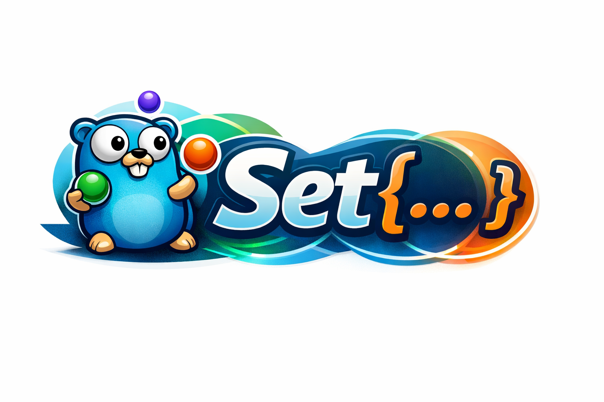

# go-set

Implements a new thread-safety type in Golang — Set. It offers a wide range of set operations (union, intersection, difference, and others). The type is based on map[T]struct{}.

**Set is a collection of unique elements of a comparable type. This data type does not preserve the order of its elements.**



```go
package main

import (
    "fmt"
    set "github.com/MothScientist/go-set"
)

func main() {

}

```